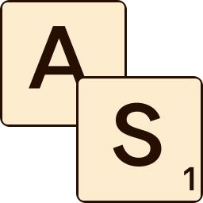

# Auto-Scrabbler

## Download

* [auto-scrabbler_0.0.6_amd64.deb](https://github.com/Achaaab/auto-scrabbler/releases/download/0.0.6/auto-scrabbler_0.0.6_amd64.deb)
* [auto-scrabbler-0.0.6.jar](https://github.com/Achaaab/auto-scrabbler/releases/download/0.0.6/auto-scrabbler-0.0.6.jar) (requires [Java 21 runtime environment](https://adoptium.net/fr/temurin/releases/?package=jre&version=21))

## Screenshots

## Authors
* **Jonathan Guéhenneux** - *Programmer* - [Achaaab](https://github.com/Achaaab)

## License
This project is licensed under the GNU General Public License (GPL) - see the [LICENSE.md](LICENSE.md) for the details.
