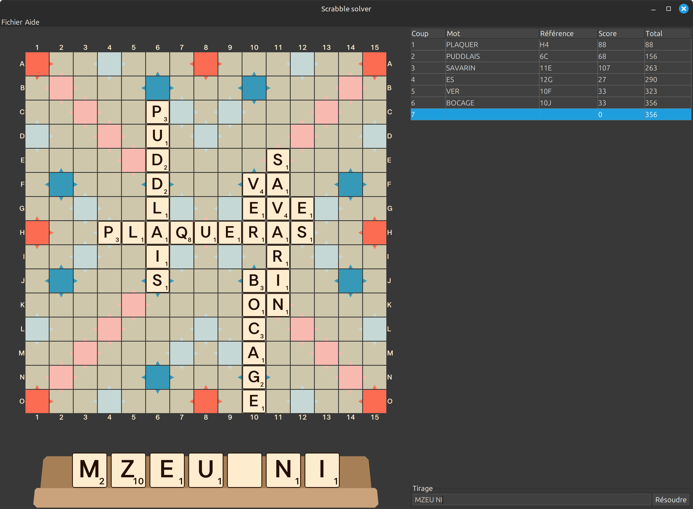
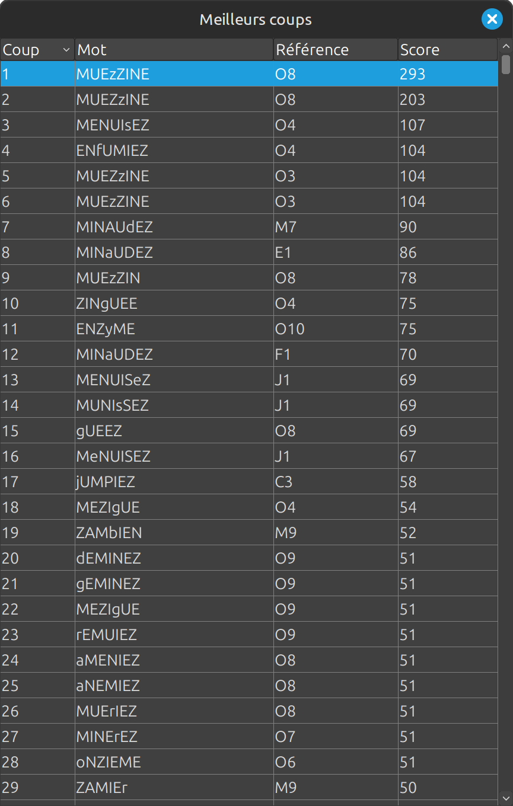
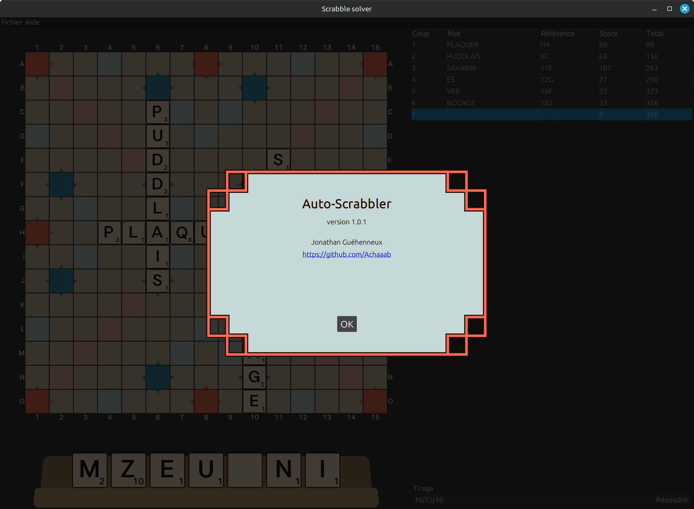

# Auto-Scrabbler

## Download
* Windows installer: [auto-scrabbler-1.0.3.exe](https://github.com/Achaaab/auto-scrabbler/releases/download/1.0.3/auto-scrabbler-1.0.3.exe)
* Debian package: [auto-scrabbler_1.0.3_amd64.deb](https://github.com/Achaaab/auto-scrabbler/releases/download/1.0.3/auto-scrabbler_1.0.3_amd64.deb)
* MacOS package: [auto-scrabbler-1.0.3.pkg](https://github.com/Achaaab/auto-scrabbler/releases/download/1.0.3/auto-scrabbler-1.0.3.pkg)
* RPM package: [auto-scrabbler-1.0.3-1.x86_64.rpm](https://github.com/Achaaab/auto-scrabbler/releases/download/1.0.3/auto-scrabbler-1.0.3-1.x86_64.rpm)
* Raw executable jar [auto-scrabbler-1.0.3.jar](https://github.com/Achaaab/auto-scrabbler/releases/download/1.0.3/auto-scrabbler-1.0.3.jar)
  (requires [Java 21 runtime environment](https://adoptium.net/fr/temurin/releases/?package=jre&version=21))

## Screenshots

## Authors
* **Jonathan Guéhenneux** - *Programmer* - [Achaaab](https://github.com/Achaaab)

## License
This project is licensed under the GNU General Public License (GPL) - see the [LICENSE.md](LICENSE.md) for the details.
